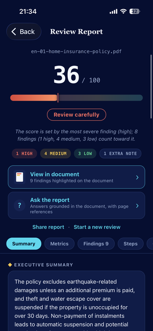
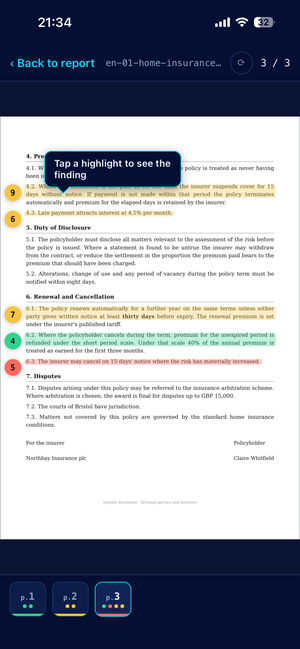

<p align="center">
  
</p>

<p align="center">
  <a href="https://audittrove.com"></a>
  
  
  
  
  
</p>

# AuditTrove

AuditTrove reads a document you already have, a contract, a lease, an insurance policy or a financial report, and turns it into a review you can act on: a score, a summary, and a list of findings. Every finding points at the page it came from and carries a quotation copied word for word from that page.

This repository is the Spring Boot service behind it. It serves three clients:

| Client | What it is |
| --- | --- |
| [AuditTrove Mobile](https://github.com/mertkaracamm/AuditTrove-Mobile) | React Native app on the App Store and Google Play |
| ChatGPT | An MCP server at `https://audittrove.com/mcp`, exposing one tool, `audit_document` |
| [audittrove.com](https://audittrove.com) | Marketing site, privacy policy, terms, support |

> AuditTrove supports your own preliminary decision. It does not determine lawfulness or regulatory compliance, and it does not replace professional financial, legal or investment advice.
>
> **Documents are not stored.** A review runs on the text supplied in that request and nothing is kept afterwards.

<p align="center">
  
  &nbsp;&nbsp;
  
</p>

## How a review is produced

The hard part is not getting a model to say something about a contract. It is getting the same document to produce the same answer twice, and making sure every sentence in the report can be traced back to the document.

**1. Text extraction.** PDFBox pulls the text layer and records a page marker for every page. For the mobile app, a scan without a text layer is OCR'd with Tesseract (`tur+eng`). The MCP path does no OCR at all; it asks the caller for `documentText` or `pageTexts`, which keeps every call well inside ChatGPT's 60 second tool limit.

**2. A fixed checklist, asked three times.** `RubricItem` holds a set of factual yes/no questions per document type, with titles and severities **fixed in code**, not written by the model. Each question goes to the primary model three times with different seeds, and the majority wins. One sample was not enough: on label-and-value forms the same document swung between one and six findings from run to run.

**3. Cross-check across three providers.** Free-form findings from the primary model are also produced by two secondary models. A finding enters the report only if **at least two of the three models saw it**. Everything else is dropped.

**4. Grounding.** A finding whose quotation cannot be located in the document is removed before the report is built. No quotation, no finding.

**5. The score is computed, not asked.** The 0 to 100 score comes from the surviving findings and their severities, in code. The model never returns a number.

The checklist prompt carries an explicit instruction not to cite any law or regulation and to report only what the document says.

## MCP server

`POST /mcp`, JSON-RPC 2.0 over Streamable HTTP, protocol version `2025-06-18`. One tool:

```
audit_document(documentText | pageTexts, filename?, language?, documentType?)
```

```bash
curl -s https://audittrove.com/mcp \
  -H 'Content-Type: application/json' \
  -H 'Accept: application/json, text/event-stream' \
  -d '{"jsonrpc":"2.0","id":1,"method":"tools/list"}'
```

Notifications (requests with no `id`) get a bodyless `202`. `GET /mcp` answers `405` with `Allow: POST`. `GET /mcp/info` returns a plain description of the server.

Measured on production: a six page text PDF returns in about 20 seconds; the no-text-layer error returns in about 1.4 seconds.

## HTTP API

| Method | Path | Purpose |
| --- | --- | --- |
| `POST` | `/api/v1/audit` | Synchronous review |
| `POST` | `/api/v1/audit/async` | Queue a review as a background job |
| `GET` | `/api/v1/audit/jobs/{id}` | Poll job status and result |
| `POST` | `/api/v1/audit/jobs/{id}/cancel` | Cancel a running job |
| `POST` | `/api/v1/audit/chat` | Ask a question about a finished review |
| `POST` | `/api/v1/audit/diff` | Compare two versions of a document |
| `POST` | `/api/v1/devices` | Register a device and issue a token |
| `POST` | `/api/v1/devices/push-token` | Store a push token for job completion |
| `POST` | `/mcp` | MCP endpoint |

Mobile clients authenticate with a device token; there is no account and no password.

## Review output

```json
{
  "riskScore": 36,
  "scoreRationale": "…",
  "summary": "…",
  "risks": [
    {
      "severity": "HIGH",
      "title": "Post-employment non-compete",
      "explanation": "…",
      "page": 2,
      "quote": "For two years after the employment ends the employee may not work for…",
      "box": { "x": 0.12, "y": 0.34, "w": 0.76, "h": 0.04 }
    }
  ],
  "metrics": [],
  "actions": [],
  "advisorQuestions": []
}
```

`box` is the position of the quoted passage on the page, normalised to 0..1, which is what lets the app highlight it on the rendered PDF.

## Layout

```
src/main/java/com/audittrove/
├── api/         REST controllers and DTOs
├── audit/       Review orchestration, background jobs, cancellation
├── chat/        Follow-up questions about a finished review
├── diff/        Version comparison between two documents
├── financial/   Deterministic financial statement engine and language gate
├── llm/         Primary (OpenAI) and secondary (Anthropic, Gemini) backends
├── mcp/         MCP server
├── pdf/         Text extraction, page markers, OCR, quote positioning
├── report/      Checklist, scoring, report gate, quote matching
└── security/    Device tokens, rate limiting
```

## Running locally

```bash
./mvnw spring-boot:run
```

Requires Java 17 and PostgreSQL. Flyway creates the schema on first boot. Swagger UI is at `/swagger-ui.html`.

Configuration lives in `application.yml` and is overridden by environment variables in deployment. The ones that matter: the three model API keys, the database URL, the device token secret, and the free-tier limits. None of them are committed.

## Tests

```bash
./mvnw test
```

23 test classes, 127 tests. They cover the parts that are easy to break and expensive to notice: the checklist questions, quote matching, score stability, the report gate, the MCP contract, and the rule that the MCP path never runs OCR.

## Deployment

Railway builds from the `Dockerfile` and deploys `main`. `audittrove.com` and the Railway domain point at the same service.
